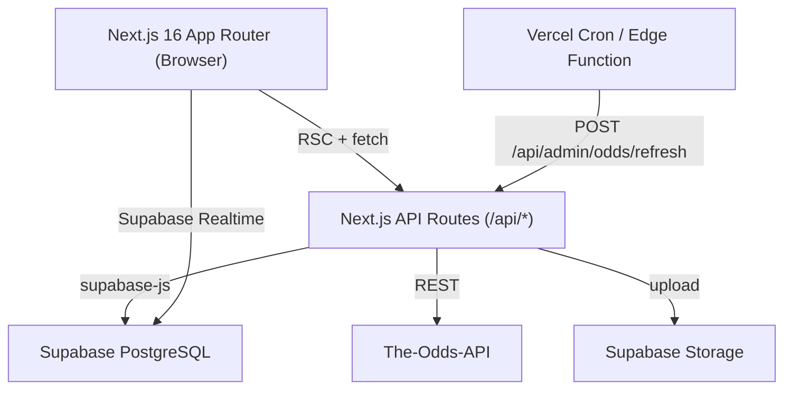

# Design Document — JMD Online Book Production-Ready Platform

## Overview

This document describes the technical design for transforming JMD Online Book into a production-ready betting platform. The existing stack (Next.js 16 App Router, Supabase PostgreSQL, Tailwind CSS 4, TypeScript) is extended with sports betting, in-house casino games, a settlement engine, The-Odds-API integration, and a comprehensive admin panel.

The platform operates as a single-tenant system. All payments remain manual UPI/bank approval. Casino results are admin-controlled. Sports odds are sourced from The-Odds-API with admin override capability.

---

## Architecture



Key architectural decisions:
- All game state mutations go through API routes (never direct client DB writes) to enforce server-side validation.
- Aviator multiplier is driven by a server-side timer; clients poll `/api/casino/aviator/state` every 100ms.
- Settlement runs inside a Postgres transaction via a dedicated RPC function to guarantee atomicity.
- The-Odds-API polling runs via a Vercel Cron job hitting `/api/admin/odds/refresh` every 60 seconds.

---

## Components and Interfaces

### Page Components

| Route | Component | Description |
|---|---|---|
| `/` | `HomePage` | Landing page — hero, ticker, sports strip, live events, casino cards, popular bets |
| `/sports` | `SportsPage` | Sports event list with odds table and bet slip |
| `/sports/[eventId]` | `EventDetailPage` | Single event odds + open bets |
| `/casino/teen-patti` | `TeenPattiPage` | Teen Patti game UI |
| `/casino/dragon-tiger` | `DragonTigerPage` | Dragon Tiger game UI |
| `/casino/andar-bahar` | `AndarBaharPage` | Andar Bahar game UI |
| `/casino/aviator` | `AviatorPage` | Aviator crash game UI |
| `/profile` | `ProfilePage` | Profile view/edit + avatar upload |
| `/wallet` | `WalletPage` | Balance, deposit/withdraw history |
| `/pnl` | `PnLPage` | P&L statement with date filter |
| `/admin` | `AdminDashboard` | Admin overview |
| `/admin/games` | `AdminGamesPage` | Casino round control |
| `/admin/sports` | `AdminSportsPage` | Sports event + odds management |
| `/admin/users` | `AdminUsersPage` | User management |
| `/admin/reports` | `AdminReportsPage` | Financial reports |
| `/admin/transactions` | `AdminTransactionsPage` | Pending deposit/withdrawal approvals |

### Shared UI Components

- `BetSlip` — slide-up drawer; accepts `marketId`, `betType`, `odds`, `minStake`; calls `POST /api/bets`
- `OddsTable` — renders Back/Lay columns; highlights override values with a badge
- `AviatorMultiplierDisplay` — animated counter polling `/api/casino/aviator/state`
- `BottomNav` — fixed 5-item nav with active highlight and wallet badge
- `AnnouncementTicker` — marquee reading from `site_settings`
- `SettlementConfirmDialog` — shows affected bet count + estimated payout before admin confirms

### API Routes

```
POST   /api/bets                          Place a bet (sports or casino)
POST   /api/bets/cashout                  Aviator cashout
GET    /api/sports/events                 List sport events (with odds)
GET    /api/sports/events/[id]            Single event detail
GET    /api/casino/[game]/round           Current round state
GET    /api/casino/aviator/state          Aviator live multiplier (polled)
POST   /api/admin/odds/refresh            Trigger immediate odds fetch
POST   /api/admin/odds/override           Set odds override
POST   /api/admin/games/round             Create/update casino round
POST   /api/admin/games/settle            Settle a casino round
POST   /api/admin/sports/settle           Settle a sports event
POST   /api/admin/sports/lock             Lock/unlock betting on event
POST   /api/admin/users/adjust-balance    Admin balance adjustment
POST   /api/admin/transactions/approve    Approve deposit/withdrawal
POST   /api/admin/transactions/reject     Reject deposit/withdrawal
GET    /api/admin/reports/summary         Daily/range financial summary
GET    /api/profile                       Get own profile
PATCH  /api/profile                       Update profile fields
POST   /api/profile/avatar                Upload avatar to Supabase Storage
```

---

## Data Models

### New Tables

#### `sport_events`
```sql
CREATE TABLE sport_events (
  id               uuid PRIMARY KEY DEFAULT gen_random_uuid(),
  tenant_id        uuid NOT NULL REFERENCES tenants(id),
  sport            varchar(50) NOT NULL,          -- 'cricket', 'football', etc.
  league           varchar(100),
  home_team        varchar(100) NOT NULL,
  away_team        varchar(100) NOT NULL,
  start_time       timestamptz NOT NULL,
  status           varchar(20) NOT NULL DEFAULT 'upcoming'
                   CHECK (status IN ('upcoming','live','suspended','settled','cancelled')),
  is_betting_locked boolean NOT NULL DEFAULT false,
  result           varchar(100),                  -- e.g. 'home_win', 'away_win', 'draw'
  external_event_id varchar(100),                 -- The-Odds-API event id
  created_at       timestamptz NOT NULL DEFAULT now(),
  updated_at       timestamptz NOT NULL DEFAULT now()
);
```

#### `odds_markets`
```sql
CREATE TABLE odds_markets (
  id                  uuid PRIMARY KEY DEFAULT gen_random_uuid(),
  event_id            uuid NOT NULL REFERENCES sport_events(id) ON DELETE CASCADE,
  market_name         varchar(100) NOT NULL,       -- e.g. 'Match Winner'
  outcome             varchar(100) NOT NULL,       -- e.g. 'home', 'away', 'draw'
  back_odds           numeric(8,4) NOT NULL,
  lay_odds            numeric(8,4) NOT NULL,
  is_active           boolean NOT NULL DEFAULT true,
  override_back_odds  numeric(8,4),
  override_lay_odds   numeric(8,4),
  is_stale            boolean NOT NULL DEFAULT false,
  created_at          timestamptz NOT NULL DEFAULT now(),
  updated_at          timestamptz NOT NULL DEFAULT now()
);
```

#### `casino_rounds`
```sql
CREATE TABLE casino_rounds (
  id          uuid PRIMARY KEY DEFAULT gen_random_uuid(),
  tenant_id   uuid NOT NULL REFERENCES tenants(id),
  game_id     uuid NOT NULL REFERENCES games(id),
  status      varchar(20) NOT NULL DEFAULT 'waiting'
              CHECK (status IN ('waiting','betting_open','dealing','result','settled')),
  result      varchar(100),
  crash_point numeric(8,2),                        -- Aviator only
  settled_at  timestamptz,
  created_at  timestamptz NOT NULL DEFAULT now()
);
```

#### `settlement_log`
```sql
CREATE TABLE settlement_log (
  id           uuid PRIMARY KEY DEFAULT gen_random_uuid(),
  event_id     uuid REFERENCES sport_events(id),
  round_id     uuid REFERENCES casino_rounds(id),
  settled_by   uuid NOT NULL REFERENCES profiles(id),
  total_bets   integer NOT NULL,
  total_payout numeric(12,2) NOT NULL,
  created_at   timestamptz NOT NULL DEFAULT now()
);
```

#### `odds_api_cache`
```sql
CREATE TABLE odds_api_cache (
  id           uuid PRIMARY KEY DEFAULT gen_random_uuid(),
  sport_key    varchar(50) NOT NULL,
  event_id     varchar(100) NOT NULL,
  raw_response jsonb NOT NULL,
  fetched_at   timestamptz NOT NULL DEFAULT now(),
  UNIQUE (sport_key, event_id)
);
```

### Extended `bets` Table
```sql
ALTER TABLE bets
  ADD COLUMN event_id          uuid REFERENCES sport_events(id),
  ADD COLUMN round_id          uuid REFERENCES casino_rounds(id),
  ADD COLUMN bet_type          varchar(10) NOT NULL DEFAULT 'casino'
                               CHECK (bet_type IN ('back','lay','casino')),
  ADD COLUMN outcome           varchar(100) NOT NULL DEFAULT '',
  ADD COLUMN cashout_multiplier numeric(8,2);   -- Aviator: multiplier at cashout
```

### TypeScript Types

```typescript
// lib/types/betting.ts

export type SportEventStatus = 'upcoming' | 'live' | 'suspended' | 'settled' | 'cancelled'
export type CasinoRoundStatus = 'waiting' | 'betting_open' | 'dealing' | 'result' | 'settled'
export type BetType = 'back' | 'lay' | 'casino'
export type BetResult = 'pending' | 'win' | 'lose' | 'void' | 'draw'

export interface SportEvent {
  id: string
  sport: string
  league: string | null
  home_team: string
  away_team: string
  start_time: string
  status: SportEventStatus
  is_betting_locked: boolean
  result: string | null
  external_event_id: string | null
  odds_markets?: OddsMarket[]
}

export interface OddsMarket {
  id: string
  event_id: string
  market_name: string
  outcome: string
  back_odds: number
  lay_odds: number
  is_active: boolean
  override_back_odds: number | null
  override_lay_odds: number | null
  is_stale: boolean
  // Computed: effective odds served to client
  effective_back_odds: number
  effective_lay_odds: number
}

export interface CasinoRound {
  id: string
  game_id: string
  status: CasinoRoundStatus
  result: string | null
  crash_point: number | null
  settled_at: string | null
  created_at: string
}

export interface PlaceBetRequest {
  event_id?: string
  round_id?: string
  market_id?: string
  bet_type: BetType
  outcome: string
  stake: number
  auto_cashout_multiplier?: number  // Aviator only
}
```

---

## The-Odds-API Integration Design

### Polling Architecture

```
Vercel Cron (every 60s)
  → POST /api/admin/odds/refresh
    → fetchOddsForSports(['cricket_ipl', 'soccer', 'tennis'])
      → GET https://api.the-odds-api.com/v4/sports/{sport}/odds
      → parseOddsResponse(raw)
      → upsertOddsMarkets(parsed)   -- skips markets with active override
      → upsertOddsApiCache(raw)
      → checkQuotaHeader()          -- pause + alert if < 100 remaining
```

### Caching Strategy

- Raw API response stored in `odds_api_cache` keyed by `(sport_key, event_id)`.
- On fetch failure, the last cached response is used; `is_stale = true` is set on affected `odds_markets` rows.
- The client-facing API reads `effective_back_odds = COALESCE(override_back_odds, back_odds)` — computed at query time, never stored separately.

### Override Logic

```typescript
// lib/odds/override.ts

export function getEffectiveOdds(market: OddsMarket): { back: number; lay: number } {
  return {
    back: market.override_back_odds ?? market.back_odds,
    lay:  market.override_lay_odds  ?? market.lay_odds,
  }
}
```

During automatic odds fetch, the upsert query uses:
```sql
UPDATE odds_markets SET
  back_odds = $new_back,
  lay_odds  = $new_lay,
  is_stale  = false,
  updated_at = now()
WHERE event_id = $event_id
  AND outcome  = $outcome
  AND override_back_odds IS NULL   -- never overwrite an active override
  AND override_lay_odds  IS NULL;
```

### Quota Guard

The-Odds-API returns `X-Requests-Remaining` in response headers. After each fetch:
```typescript
const remaining = parseInt(res.headers.get('x-requests-remaining') ?? '9999')
if (remaining < 100) {
  await supabase.from('site_settings')
    .update({ odds_api_paused: true, odds_api_quota_alert: true })
    .eq('id', TENANT_SETTINGS_ID)
}
```
The admin dashboard reads `odds_api_quota_alert` and displays a banner.

### Odds Parse / Serialise

```typescript
// lib/odds/parser.ts

export interface OddsApiEvent {
  id: string
  sport_key: string
  home_team: string
  away_team: string
  bookmakers: Array<{
    key: string
    markets: Array<{
      key: string
      outcomes: Array<{ name: string; price: number }>
    }>
  }>
}

export function parseOddsResponse(raw: OddsApiEvent[]): ParsedMarket[] {
  return raw.flatMap(event =>
    event.bookmakers[0]?.markets.flatMap(market =>
      market.outcomes.map(outcome => ({
        external_event_id: event.id,
        market_name: market.key,
        outcome: outcome.name,
        back_odds: round4dp(outcome.price),
        lay_odds:  round4dp(outcome.price * 1.02),  // synthetic lay = back + 2% margin
      }))
    ) ?? []
  )
}

function round4dp(n: number): number {
  return Math.round(n * 10000) / 10000
}
```

---

## Aviator Real-Time Multiplier Design

### Server-Side Round State

The crash point is set by the admin before the round starts and stored in `casino_rounds.crash_point`. It is never sent to the client until the round ends.

```typescript
// lib/casino/aviator.ts

interface AviatorRoundState {
  round_id: string
  status: 'betting_open' | 'flying' | 'crashed'
  multiplier: number        // current live value
  crash_point: number       // server-only until crashed
  started_at: number        // Date.now() when flying began
}

// Multiplier formula: grows exponentially from 1.00
// M(t) = e^(0.00006 * t_ms) where t_ms = elapsed milliseconds
export function computeMultiplier(started_at: number): number {
  const elapsed = Date.now() - started_at
  return Math.round(Math.exp(0.00006 * elapsed) * 100) / 100
}
```

### Client Polling

`AviatorPage` polls `GET /api/casino/aviator/state` every 100ms:

```typescript
// app/casino/aviator/page.tsx (simplified)
useEffect(() => {
  const interval = setInterval(async () => {
    const res = await fetch('/api/casino/aviator/state')
    const { multiplier, status, crash_point_revealed } = await res.json()
    setMultiplier(multiplier)
    if (status === 'crashed') {
      setCrashPoint(crash_point_revealed)
      clearInterval(interval)
    }
  }, 100)
  return () => clearInterval(interval)
}, [roundId])
```

### API Route Response

```typescript
// app/api/casino/aviator/state/route.ts
// Returns:
{
  round_id: string
  status: 'betting_open' | 'flying' | 'crashed'
  multiplier: number          // computed server-side
  crash_point_revealed: number | null  // null until crashed
}
// crash_point is NEVER included in the response while status !== 'crashed'
```

### Auto-Cashout

When a bet is placed with `auto_cashout_multiplier`, the server checks on each state poll:
```sql
-- Runs inside /api/casino/aviator/state handler
UPDATE bets SET
  result = 'win',
  payout = stake * $current_multiplier,
  cashout_multiplier = $current_multiplier
WHERE round_id = $round_id
  AND result = 'pending'
  AND auto_cashout_multiplier <= $current_multiplier
  AND auto_cashout_multiplier < (SELECT crash_point FROM casino_rounds WHERE id = $round_id);
```
Then credits wallet via `update_balance` RPC for each auto-cashed bet.

---

## Settlement Engine Design

### Core Principle: Idempotent Atomic Settlement

Settlement is implemented as a single Postgres RPC function. The idempotency guard checks `casino_rounds.status = 'settled'` or `sport_events.status = 'settled'` before doing any work.

```sql
-- supabase/migrations/settle_event.sql

CREATE OR REPLACE FUNCTION settle_sport_event(
  p_event_id   uuid,
  p_result     varchar,
  p_admin_id   uuid
) RETURNS jsonb
LANGUAGE plpgsql
AS $$
DECLARE
  v_bet         RECORD;
  v_payout      numeric;
  v_total_bets  integer := 0;
  v_total_payout numeric := 0;
BEGIN
  -- Idempotency guard
  IF EXISTS (
    SELECT 1 FROM sport_events WHERE id = p_event_id AND status = 'settled'
  ) THEN
    RETURN jsonb_build_object('already_settled', true);
  END IF;

  -- Lock the event row to prevent concurrent settlement
  PERFORM id FROM sport_events WHERE id = p_event_id FOR UPDATE;

  -- Process each pending bet
  FOR v_bet IN
    SELECT b.id, b.user_id, b.stake, b.outcome,
           om.back_odds, om.lay_odds, b.bet_type
    FROM bets b
    JOIN odds_markets om ON om.id = b.market_id
    WHERE b.event_id = p_event_id AND b.result = 'pending'
  LOOP
    v_total_bets := v_total_bets + 1;

    -- Determine result and payout
    IF v_bet.outcome = p_result THEN
      -- Win: payout = stake × odds
      v_payout := CASE v_bet.bet_type
        WHEN 'back' THEN v_bet.stake * v_bet.back_odds
        WHEN 'lay'  THEN v_bet.stake * v_bet.lay_odds
      END;
      UPDATE bets SET result = 'win', payout = v_payout WHERE id = v_bet.id;
      PERFORM update_balance(v_bet.user_id, v_payout, 'win', v_bet.id::text);
    ELSIF p_result = 'void' THEN
      -- Void: refund stake
      v_payout := v_bet.stake;
      UPDATE bets SET result = 'void', payout = v_payout WHERE id = v_bet.id;
      PERFORM update_balance(v_bet.user_id, v_payout, 'refund', v_bet.id::text);
    ELSIF p_result = 'draw' THEN
      -- Draw: refund stake
      v_payout := v_bet.stake;
      UPDATE bets SET result = 'draw', payout = v_payout WHERE id = v_bet.id;
      PERFORM update_balance(v_bet.user_id, v_payout, 'refund', v_bet.id::text);
    ELSE
      -- Lose
      v_payout := 0;
      UPDATE bets SET result = 'lose', payout = 0 WHERE id = v_bet.id;
    END IF;

    v_total_payout := v_total_payout + v_payout;
  END LOOP;

  -- Mark event settled
  UPDATE sport_events SET status = 'settled', result = p_result, updated_at = now()
  WHERE id = p_event_id;

  -- Write settlement log
  INSERT INTO settlement_log (event_id, settled_by, total_bets, total_payout)
  VALUES (p_event_id, p_admin_id, v_total_bets, v_total_payout);

  RETURN jsonb_build_object(
    'total_bets', v_total_bets,
    'total_payout', v_total_payout
  );
END;
$$;
```

A parallel `settle_casino_round` function follows the same pattern, using game-specific payout multipliers:

```typescript
// lib/settlement/casinoPayouts.ts

export const CASINO_PAYOUTS: Record<string, Record<string, number>> = {
  teen_patti:   { win: 1.95, tie: 8.0,  lose: 0 },
  dragon_tiger: { win: 1.95, tie: 8.0,  lose: 0 },
  andar_bahar:  { win: 1.90,            lose: 0 },
}

export function getCasinoPayout(game: string, betOutcome: string, result: string): number {
  if (betOutcome !== result) return 0
  return CASINO_PAYOUTS[game]?.[result === betOutcome ? 'win' : 'lose'] ?? 0
}
```

### Wallet Update RPC

The existing `update_balance` function is used for all credits. It must be called with a reference ID to support idempotency:

```sql
-- Existing function signature (assumed):
-- update_balance(user_id uuid, amount numeric, type varchar, reference_id varchar)
-- The function should use ON CONFLICT DO NOTHING on transactions table keyed by reference_id
```

---

## Admin Panel Structure

### Game Control (`/admin/games`)

- Lists all `casino_rounds` grouped by game, showing status and bet count.
- "New Round" button creates a `casino_rounds` row with `status = 'waiting'`.
- "Open Betting" transitions round to `betting_open`.
- For Aviator: admin enters crash point (hidden from users) before opening betting.
- "Set Result" opens `SettlementConfirmDialog` showing affected bets + estimated payout.
- On confirm: calls `POST /api/admin/games/settle` → invokes `settle_casino_round` RPC.
- Idempotency: if round already `settled`, the API returns `{ already_settled: true }` and shows a toast.

### Odds Management (`/admin/sports`)

- Table of all `sport_events` with inline odds editing per `odds_markets` row.
- Override badge shown when `override_back_odds IS NOT NULL`.
- "Clear Override" button calls `POST /api/admin/odds/override` with `null` values.
- "Refresh Odds" button calls `POST /api/admin/odds/refresh`.
- "Add Event" form: sport, league, home_team, away_team, start_time, initial back/lay odds.
- Lock/Unlock toggle calls `POST /api/admin/sports/lock`.
- Quota alert banner shown when `site_settings.odds_api_quota_alert = true`.

### User Management (`/admin/users`)

- Paginated table (20 per page) with search by name/phone.
- Row actions: View Detail, Suspend/Activate, Adjust Balance.
- Balance adjustment form validates `current_balance + delta >= 0` client-side and server-side.
- User detail page shows full transaction history and bet history in tabs.

### Financial Reports (`/admin/reports`)

- Date range picker (default: today).
- Summary cards: Total Deposits, Total Withdrawals, Total Bets, Total Payouts, House P&L.
- P&L breakdown table by category (sports / casino).
- Top 10 users by net loss table.
- All figures computed via a single SQL query:

```sql
-- /api/admin/reports/summary
SELECT
  SUM(CASE WHEN t.type = 'deposit'    AND t.status = 'approved' THEN t.amount ELSE 0 END) AS total_deposits,
  SUM(CASE WHEN t.type = 'withdrawal' AND t.status = 'approved' THEN t.amount ELSE 0 END) AS total_withdrawals,
  COUNT(CASE WHEN b.result != 'pending' THEN 1 END)                                        AS total_bets,
  SUM(COALESCE(b.payout, 0))                                                               AS total_payouts,
  SUM(b.stake) - SUM(COALESCE(b.payout, 0))                                               AS house_pnl
FROM transactions t
FULL OUTER JOIN bets b ON b.user_id = t.user_id
WHERE (t.created_at BETWEEN $start AND $end OR b.created_at BETWEEN $start AND $end)
  AND t.tenant_id = $tenant_id;
```

### Transaction Approvals (`/admin/transactions`)

- Lists pending deposits and withdrawals with approve/reject buttons.
- Approve deposit → `update_balance(user_id, amount, 'deposit', tx_id)` + set `status = 'approved'`.
- Approve withdrawal → checks `balance >= amount` → `update_balance(user_id, -amount, 'withdrawal', tx_id)`.
- Reject → sets `status = 'rejected'` + sends notification.

---

## Row Level Security Policies

```sql
-- sport_events: all authenticated users can read; only admins can write
ALTER TABLE sport_events ENABLE ROW LEVEL SECURITY;
CREATE POLICY "read_sport_events" ON sport_events FOR SELECT USING (auth.role() = 'authenticated');
CREATE POLICY "admin_write_sport_events" ON sport_events FOR ALL USING (
  EXISTS (SELECT 1 FROM profiles WHERE id = auth.uid() AND role = 'admin')
);

-- odds_markets: same as sport_events
ALTER TABLE odds_markets ENABLE ROW LEVEL SECURITY;
CREATE POLICY "read_odds_markets" ON odds_markets FOR SELECT USING (auth.role() = 'authenticated');
CREATE POLICY "admin_write_odds_markets" ON odds_markets FOR ALL USING (
  EXISTS (SELECT 1 FROM profiles WHERE id = auth.uid() AND role = 'admin')
);

-- casino_rounds: authenticated read; admin write
ALTER TABLE casino_rounds ENABLE ROW LEVEL SECURITY;
CREATE POLICY "read_casino_rounds" ON casino_rounds FOR SELECT USING (auth.role() = 'authenticated');
CREATE POLICY "admin_write_casino_rounds" ON casino_rounds FOR ALL USING (
  EXISTS (SELECT 1 FROM profiles WHERE id = auth.uid() AND role = 'admin')
);

-- settlement_log: admin only
ALTER TABLE settlement_log ENABLE ROW LEVEL SECURITY;
CREATE POLICY "admin_settlement_log" ON settlement_log FOR ALL USING (
  EXISTS (SELECT 1 FROM profiles WHERE id = auth.uid() AND role = 'admin')
);

-- odds_api_cache: admin only
ALTER TABLE odds_api_cache ENABLE ROW LEVEL SECURITY;
CREATE POLICY "admin_odds_cache" ON odds_api_cache FOR ALL USING (
  EXISTS (SELECT 1 FROM profiles WHERE id = auth.uid() AND role = 'admin')
);
```

---

## Correctness Properties

*A property is a characteristic or behavior that should hold true across all valid executions of a system — essentially, a formal statement about what the system should do. Properties serve as the bridge between human-readable specifications and machine-verifiable correctness guarantees.*

### Property 1: Sports Bet Payout Invariant

*For any* winning sports Bet with any valid stake and odds values, `payout = stake × effective_odds`. For any losing Bet, `payout = 0`. For any void or draw Bet, `payout = stake`.

**Validates: Requirements 12.2, 12.3, 12.4, 12.5, P1**

### Property 2: Settlement Idempotency

*For any* settled Sports_Event or Casino_Round, running the settlement function a second time must produce zero changes to any Wallet balance, Bet record, or Transaction record — the function must return `{ already_settled: true }` and leave all state unchanged.

**Validates: Requirements 8.4, 12.7, P2**

### Property 3: Wallet Non-Negative on Bet Placement

*For any* bet placement attempt where `stake > current_balance`, the system must reject the bet, leave the Wallet balance unchanged, and return an error. The balance must never go negative as a result of bet placement.

**Validates: Requirements 2.6, P3**

### Property 4: Aviator Payout Invariant

*For any* Aviator Bet cashed out at multiplier M (where M < crash_point), `payout = stake × M`. For any Aviator Bet where the player did not cash out before the crash point, `payout = 0`.

**Validates: Requirements 7.4, 7.5, P4**

### Property 5: Casino Payout Correctness

*For any* Teen Patti or Dragon Tiger winning non-Tie Bet with any valid stake, `payout = stake × 1.95`. For any Tie Bet win, `payout = stake × 8.0`. For any Andar Bahar winning Bet, `payout = stake × 1.90`. For any losing casino Bet, `payout = 0`.

**Validates: Requirements 4.6, 5.5, 6.5, P9**

### Property 6: P&L Aggregation Invariant

*For any* User and any date range, `sum(payout − stake)` across all settled Bets in that range must equal the aggregate `net_pnl` value returned by the P&L endpoint. No rounding or filtering discrepancy is permitted.

**Validates: Requirements 14.7, P5**

### Property 7: Profile Round-Trip

*For any* valid set of profile field values (name, UPI ID, IFSC code, bank account, etc.), saving the profile via `PATCH /api/profile` then fetching it via `GET /api/profile` must return identical field values.

**Validates: Requirements 13.9, P6**

### Property 8: Odds Parse Round-Trip

*For any* valid The-Odds-API JSON response, parsing it into `OddsMarket` records via `parseOddsResponse` then re-serialising those records must produce odds values equal to the original parsed values within 4 decimal places of precision.

**Validates: Requirements 17.8, P7**

### Property 9: Balance Adjustment Non-Negative Guard

*For any* admin balance adjustment where `current_balance + adjustment < 0`, the system must reject the adjustment and leave the Wallet balance unchanged.

**Validates: Requirements 10.6, P8**

### Property 10: Locked Event Bet Rejection

*For any* Sports_Event with `is_betting_locked = true`, any bet placement attempt on that event must be rejected regardless of stake amount, and the Wallet balance must remain unchanged.

**Validates: Requirements 3.5, 2.11**

---

## Error Handling

| Scenario | Handling |
|---|---|
| The-Odds-API 4xx/5xx | Log error, retain cached odds, set `is_stale = true`, show "Odds may be delayed" label |
| The-Odds-API quota < 100 | Pause cron, set `odds_api_quota_alert = true`, show admin banner |
| Bet placement with insufficient balance | Return 400 `{ error: 'insufficient_balance' }`, no DB write |
| Bet on locked event | Return 400 `{ error: 'betting_suspended' }` |
| Settlement on already-settled event | Return 200 `{ already_settled: true }`, no mutations |
| Aviator cashout after crash | Return 400 `{ error: 'round_ended' }`, bet marked lose |
| Avatar upload > 2MB | Return 400 `{ error: 'file_too_large' }` before Supabase upload |
| Invalid UPI ID format | Return 422 `{ error: 'invalid_upi_id' }` |
| Invalid IFSC format | Return 422 `{ error: 'invalid_ifsc' }` |
| Negative balance adjustment | Return 400 `{ error: 'negative_balance_result' }` |
| Withdrawal approval with insufficient balance | Return 400 `{ error: 'insufficient_user_balance' }` |

All API routes return consistent error shape: `{ error: string, details?: string }`.

---

## Testing Strategy

### Unit Tests (Vitest)

Focus on pure functions and business logic:
- `parseOddsResponse` — various API response shapes
- `computeMultiplier` — time-based multiplier formula
- `getEffectiveOdds` — override vs API value selection
- `getCasinoPayout` — all game/outcome combinations
- Profile field validators (UPI regex, IFSC regex)
- P&L calculation functions

### Property-Based Tests (fast-check)

Each property test runs minimum 100 iterations. Tag format: `Feature: jmd-production-ready, Property N: <text>`

- **Property 1** — Generate random `(stake, odds, result)` tuples; verify payout formula holds for all win/lose/void/draw combinations.
- **Property 2** — Generate a settled event state; call `settle_sport_event` twice; assert second call returns `already_settled: true` and no state changes.
- **Property 3** — Generate `(stake, balance)` where `stake > balance`; assert bet placement returns error and balance is unchanged.
- **Property 4** — Generate `(stake, multiplier, crash_point)` pairs; assert cashout payout = `stake × multiplier` when `multiplier < crash_point`, else 0.
- **Property 5** — Generate random valid stakes; assert casino payout formulas hold for all game types and outcomes.
- **Property 6** — Generate random collections of settled bets; assert `sum(payout - stake) = aggregate_net_pnl`.
- **Property 7** — Generate random valid profile objects; save then fetch; assert deep equality.
- **Property 8** — Generate random valid Odds-API response objects; parse then re-serialise; assert odds values match within 4dp.
- **Property 9** — Generate `(balance, adjustment)` where `balance + adjustment < 0`; assert rejection and unchanged balance.
- **Property 10** — Generate random bets against locked events; assert all are rejected.

### Integration Tests

- Supabase RLS policies: verify users cannot read other users' bets.
- Settlement RPC: run against a test Supabase instance with seeded data.
- The-Odds-API fetch: mock HTTP responses and verify upsert behaviour.
- Wallet `update_balance` RPC: verify atomicity under concurrent calls.

### Smoke Tests

- All new tables exist with correct columns after migration.
- RLS is enabled on all new tables.
- Vercel Cron endpoint returns 200.
- Admin routes return 403 for non-admin users.
