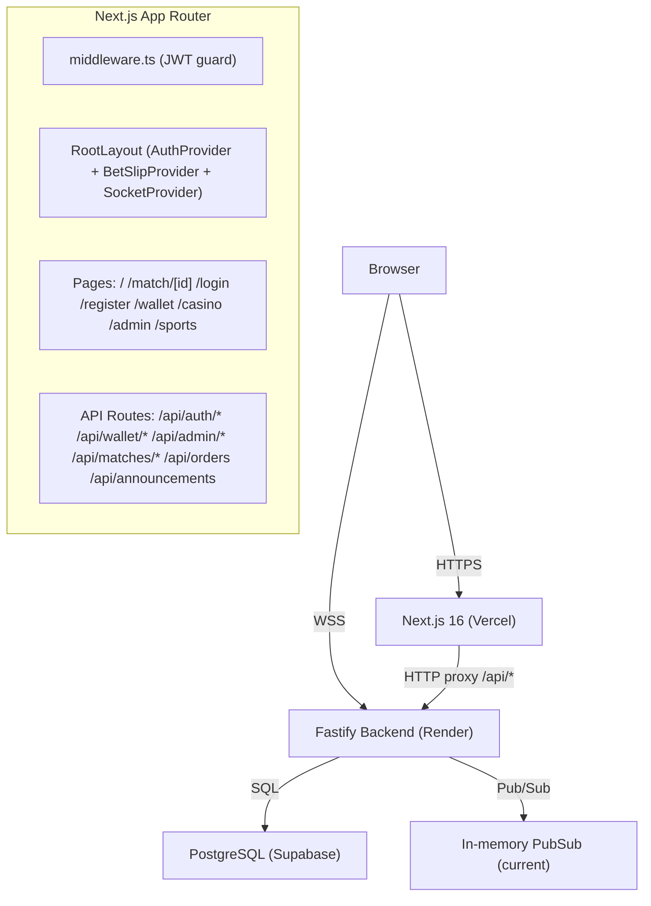

# Design Document — SBE Sunexch Redesign

## Overview

The redesign transforms the current single-page SBE app into a full-featured sports betting exchange modelled on sunexch.com. The existing Fastify + PostgreSQL backend is extended with auth, wallet, admin, and announcement endpoints. The Next.js 16 App Router frontend gains proper routing, a global auth context, a sliding bet slip, casino section, and admin panel — all in a mobile-first dark theme.

Key design decisions:
- **No external state library.** Auth, bet slip, and WebSocket state live in React Context + hooks.
- **JWT in httpOnly cookie.** The Next.js middleware reads the cookie server-side to protect routes; the client never touches the raw token.
- **Proxy pattern preserved.** All `/api/*` Next.js routes proxy to the Fastify backend, keeping CORS simple and secrets server-side.
- **Color system locked.** Back = `bg-blue-600` / `border-blue-500`, Lay = `bg-pink-600` / `border-pink-500`, background = `bg-[#0f1923]`.

---

## Architecture



---

## Page / Route Architecture

All routes live under `sbe/web/src/app/`.

| Route | File | Auth Required | Role |
|---|---|---|---|
| `/` | `app/page.tsx` | No | Homepage — banners + in-play list |
| `/match/[id]` | `app/match/[id]/page.tsx` | No | Match detail + order book + bet slip |
| `/sports` | `app/sports/page.tsx` | No | Sport category listing |
| `/casino` | `app/casino/page.tsx` | No (play requires auth) | Casino game grid |
| `/casino/[game]` | `app/casino/[game]/page.tsx` | Yes | Individual game iframe |
| `/wallet` | `app/wallet/page.tsx` | Yes | Balance, deposit, withdraw, history |
| `/login` | `app/login/page.tsx` | No (redirect if authed) | Login form |
| `/register` | `app/register/page.tsx` | No (redirect if authed) | Registration form |
| `/admin` | `app/admin/page.tsx` | Yes (admin role) | Admin panel |

### Next.js Middleware

`middleware.ts` at the project root intercepts every request:
- Reads `sbe_token` httpOnly cookie.
- Verifies JWT signature using `NEXTAUTH_SECRET`.
- Redirects `/wallet`, `/admin`, `/casino/[game]` to `/login` if no valid token.
- Redirects `/admin` to `/` if token exists but role ≠ `admin`.
- Redirects `/login` and `/register` to `/` if already authenticated.

---

## Component Tree

```
RootLayout
├── AuthProvider          (context: user, login, logout, loading)
├── BetSlipProvider       (context: selection, open/close, place bet)
├── SocketProvider        (context: connected, subscribe, on)
│
├── Header
│   ├── Logo
│   ├── SportCategoryTabs (desktop only, hidden < md)
│   ├── AnnouncementTicker
│   ├── BalanceDisplay    (shows balance when authed)
│   └── AuthButtons       (Login/Register or Username+Logout)
│
├── MobileBottomNav       (fixed, visible < md)
│   └── NavItem × 5       (Home, In-Play, Sports, Casino, Wallet)
│
├── [page content]
│
└── BetSlipDrawer         (fixed bottom on mobile, sidebar on desktop)
    ├── SelectionHeader   (team, market, side badge)
    ├── OddsInput
    ├── StakeInput
    ├── QuickStakeButtons (₹100 ₹500 ₹1000 ₹2000 ₹5000)
    ├── LiabilityDisplay
    ├── ProfitDisplay
    └── PlaceBetButton
```

### Component Props

```typescript
// Header
interface HeaderProps {} // reads AuthContext, BetSlipContext

// AnnouncementTicker
interface AnnouncementTickerProps {
  announcements: Announcement[];
}

// SportCategoryTabs
interface SportCategoryTabsProps {
  active: SportCategory;
  onChange: (cat: SportCategory) => void;
}

// MatchCard (listing row)
interface MatchCardProps {
  match: Match;
  onOddsClick: (selection: BetSelection) => void;
  compact?: boolean; // mobile stacked vs desktop table row
}

// OddsButton
interface OddsButtonProps {
  price: string;
  size: number;
  side: "back" | "lay";
  onClick: () => void;
  highlighted?: boolean;
}

// OrderBook
interface OrderBookProps {
  matchId: string;
  backs: PriceLevel[];
  lays: PriceLevel[];
  onSelect: (selection: BetSelection) => void;
}

// BetSlipDrawer
interface BetSlipDrawerProps {} // reads BetSlipContext

// PriceLadder
interface PriceLadderProps {
  matchId: string;
  backs: PriceLevel[];
  lays: PriceLevel[];
}

// MarketChart
interface MarketChartProps {
  matchId: string;
}

// LiveScoreWidget
interface LiveScoreWidgetProps {
  match: Match;
}

// CasinoGameCard
interface CasinoGameCardProps {
  game: CasinoGame;
  onPlay: (game: CasinoGame) => void;
}

// AdminMatchRow
interface AdminMatchRowProps {
  match: Match;
  onSettle: (matchId: string) => void;
  onSetInPlay: (matchId: string) => void;
}

// DepositRequestRow
interface DepositRequestRowProps {
  deposit: DepositRequest;
  onApprove: (id: string) => void;
  onReject: (id: string) => void;
}
```

---

## API Routes

### Next.js Proxy Routes (`sbe/web/src/app/api/`)

| Method | Path | Proxies To | Auth |
|---|---|---|---|
| POST | `/api/auth/login` | `POST /auth/login` | No |
| POST | `/api/auth/register` | `POST /auth/register` | No |
| DELETE | `/api/auth/logout` | — (clears cookie) | No |
| GET | `/api/wallet/balance` | `GET /wallet/balance` | JWT cookie |
| POST | `/api/wallet/deposit` | `POST /wallet/deposit` | JWT cookie |
| POST | `/api/wallet/withdraw` | `POST /wallet/withdraw` | JWT cookie |
| GET | `/api/wallet/transactions` | `GET /wallet/transactions` | JWT cookie |
| POST | `/api/orders` | `POST /orders` | JWT cookie |
| GET | `/api/matches` | `GET /matches` | No |
| GET | `/api/matches/active` | `GET /matches/active` | No |
| GET | `/api/matches/[id]` | `GET /matches/:id` | No |
| GET | `/api/matches/[id]/history` | `GET /matches/:id/history` | No |
| GET | `/api/announcements` | `GET /announcements` | No |
| GET | `/api/admin/deposits` | `GET /admin/deposits` | JWT cookie (admin) |
| POST | `/api/admin/deposits/[id]/approve` | `POST /admin/deposits/:id/approve` | JWT cookie (admin) |
| POST | `/api/admin/deposits/[id]/reject` | `POST /admin/deposits/:id/reject` | JWT cookie (admin) |
| GET | `/api/admin/users` | `GET /admin/users` | JWT cookie (admin) |
| GET | `/api/admin/announcements` | `GET /admin/announcements` | JWT cookie (admin) |
| POST | `/api/admin/announcements` | `POST /admin/announcements` | JWT cookie (admin) |
| PUT | `/api/admin/announcements/[id]` | `PUT /admin/announcements/:id` | JWT cookie (admin) |
| DELETE | `/api/admin/announcements/[id]` | `DELETE /admin/announcements/:id` | JWT cookie (admin) |
| POST | `/api/admin/matches/[id]/settle` | `POST /admin/matches/:id/settle` | JWT cookie (admin) |

### New Fastify Backend Routes (`sbe/backend/src/routes/`)

| Method | Path | Handler File | Description |
|---|---|---|---|
| POST | `/auth/register` | `routes/auth.ts` | Create user + wallet, return JWT |
| POST | `/auth/login` | `routes/auth.ts` | Verify password, return JWT |
| GET | `/wallet/balance` | `routes/wallet.ts` | Return `{ available, locked }` |
| POST | `/wallet/deposit` | `routes/wallet.ts` | Create pending deposit record |
| POST | `/wallet/withdraw` | `routes/wallet.ts` | Create pending withdrawal record |
| GET | `/wallet/transactions` | `routes/wallet.ts` | Paginated ledger entries |
| GET | `/announcements` | `routes/announcements.ts` | Active announcements list |
| GET | `/admin/deposits` | `routes/admin.ts` | All pending deposits |
| POST | `/admin/deposits/:id/approve` | `routes/admin.ts` | Credit wallet, mark approved |
| POST | `/admin/deposits/:id/reject` | `routes/admin.ts` | Mark rejected |
| GET | `/admin/users` | `routes/admin.ts` | All users with balances |
| GET | `/admin/announcements` | `routes/announcements.ts` | All announcements (admin) |
| POST | `/admin/announcements` | `routes/announcements.ts` | Create announcement |
| PUT | `/admin/announcements/:id` | `routes/announcements.ts` | Update announcement |
| DELETE | `/admin/announcements/:id` | `routes/announcements.ts` | Delete announcement |

---

## Data Models

```typescript
// ── Core Entities ──────────────────────────────────────────────

export type SportCategory = "cricket" | "football" | "tennis" | "horse_racing" | "casino" | "other";

export type MatchStatus = "scheduled" | "in_play" | "completed" | "cancelled";

export type OrderSide = "back" | "lay";

export type OrderStatus = "open" | "partially_filled" | "filled" | "cancelled";

export type TransactionType = "deposit" | "withdrawal" | "bet_lock" | "bet_release" | "settlement" | "bonus";

export type TransactionStatus = "pending" | "approved" | "rejected" | "completed";

export type UserRole = "user" | "admin";

// ── User ───────────────────────────────────────────────────────

export interface User {
  id: string;           // UUID
  username: string;
  email: string;
  role: UserRole;
  createdAt: string;    // ISO 8601
}

// Returned from /api/auth/login — never stored client-side raw
export interface AuthResponse {
  user: User;
  token: string;        // JWT — set as httpOnly cookie by Next.js proxy
}

// ── Wallet ─────────────────────────────────────────────────────

export interface WalletBalance {
  available: number;    // INR, 2 decimal places for display
  locked: number;
  currency: "INR";
}

export interface Transaction {
  id: string;
  type: TransactionType;
  amount: number;
  status: TransactionStatus;
  referenceId?: string; // orderId, depositId, etc.
  createdAt: string;
  description?: string;
}

// ── Deposit / Withdrawal Requests ──────────────────────────────

export interface DepositRequest {
  id: string;
  userId: string;
  username?: string;    // joined for admin view
  amount: number;
  upiId: string;
  utrNumber: string;
  status: TransactionStatus;
  createdAt: string;
}

export interface WithdrawalRequest {
  id: string;
  userId: string;
  amount: number;
  upiId: string;
  status: TransactionStatus;
  createdAt: string;
}

// ── Match / Market ─────────────────────────────────────────────

export interface Tournament {
  id: string;
  name: string;
  sportType: SportCategory;
}

export interface Match {
  id: string;
  tournamentId: string;
  tournamentName?: string;  // joined
  teamA: string;
  teamB: string;
  startTime: string;
  status: MatchStatus;
  sportType: SportCategory;
  score?: MatchScore;
  elapsedMinutes?: number;
}

export interface MatchScore {
  teamA: string;  // e.g. "2" or "45/3"
  teamB: string;
}

// ── Order Book ─────────────────────────────────────────────────

export interface PriceLevel {
  price: string;   // decimal string e.g. "2.10"
  size: number;    // available quantity in INR
}

export interface OrderBook {
  matchId: string;
  backs: PriceLevel[];  // sorted best (highest) first, max 3 shown
  lays: PriceLevel[];   // sorted best (lowest) first, max 3 shown
}

// ── Order / Bet ────────────────────────────────────────────────

export interface Order {
  id: string;
  userId: string;
  matchId: string;
  side: OrderSide;
  price: number;        // decimal odds
  stake: number;        // INR
  filledStake: number;
  status: OrderStatus;
  createdAt: string;
}

// ── Bet Slip Selection (client-side only) ──────────────────────

export interface BetSelection {
  matchId: string;
  matchTitle: string;   // "Team A v Team B"
  market: string;       // e.g. "Match Odds"
  selectionName: string;
  side: OrderSide;
  odds: number;
  stake: number;
}

// Derived values — computed in useBetSlip hook
export interface BetSlipCalc {
  liability: number;    // lay: stake * (odds - 1); back: 0
  netProfit: number;    // back: stake * (odds - 1); lay: stake
}

// ── Announcement ───────────────────────────────────────────────

export interface Announcement {
  id: string;
  message: string;
  active: boolean;
  createdAt: string;
  updatedAt: string;
}

// ── Casino ─────────────────────────────────────────────────────

export type CasinoGameSlug = "teen-patti" | "dragon-tiger" | "andar-bahar" | "aviator";

export interface CasinoGame {
  slug: CasinoGameSlug;
  name: string;
  thumbnailUrl: string;
  iframeUrl?: string;   // populated when session exists
  description: string;
}

// ── Candle (chart) ─────────────────────────────────────────────

export interface Candle {
  time: number;   // Unix seconds
  open: number;
  high: number;
  low: number;
  close: number;
  volume?: number;
}
```

---

## WebSocket Event Schema

All WebSocket messages follow the envelope `{ topic: string, ...payload }`.

### Client → Server

```typescript
// Subscribe to a match room
{ type: "subscribe", room: string }   // room = matchId

// Unsubscribe
{ type: "unsubscribe", room: string }

// Authenticate (send after connect when session exists)
{ type: "auth", token: string }
```

### Server → Client

```typescript
// Order book snapshot for a match
{
  topic: "orderbook_update",
  room: string,           // matchId
  snapshot: {
    backs: [string, number][],  // [price, size][]
    lays:  [string, number][]
  }
}

// Candlestick update
{
  topic: "candle_update",
  room: string,
  candle: {
    time: number,   // Unix ms
    open: number,
    high: number,
    low: number,
    close: number
  }
}

// Match score / status update
{
  topic: "match_update",
  matchId: string,
  status: MatchStatus,
  score?: { teamA: string, teamB: string },
  elapsedMinutes?: number
}

// Wallet balance update (sent to authenticated user's personal room)
{
  topic: "balance_update",
  userId: string,
  available: number,
  locked: number
}

// Recent trade event
{
  topic: "match_events",
  room: string,
  events: Array<{ price: number, size: number }>
}
```

---

## Auth Flow

### Registration

1. User submits `/register` form → POST `/api/auth/register` → Fastify creates user row + INR wallet row → returns `{ user }`.
2. Next.js proxy redirects client to `/login`.

### Login

1. User submits `/login` form → POST `/api/auth/login` → Fastify verifies bcrypt hash → signs JWT `{ sub: userId, role, username, exp }` → returns `{ token, user }`.
2. Next.js proxy sets `Set-Cookie: sbe_token=<jwt>; HttpOnly; Secure; SameSite=Strict; Path=/; Max-Age=604800`.
3. Client receives `{ user }` (no raw token) → `AuthContext` stores user object in React state.

### Logout

1. Client calls DELETE `/api/auth/logout` → Next.js proxy clears the cookie → `AuthContext` sets user to `null`.

### Protected Route Guard

```
middleware.ts
  ├── reads cookies().get("sbe_token")
  ├── verifies with jose/jwtVerify(token, secret)
  ├── if invalid/missing → NextResponse.redirect("/login") for protected paths
  └── if role !== "admin" → NextResponse.redirect("/") for /admin
```

### Authenticated API Calls

The Next.js proxy routes read the `sbe_token` cookie from the incoming request and forward it as `Authorization: Bearer <token>` to the Fastify backend. The client never needs to manage the token.

```typescript
// Pattern used in all authenticated proxy routes
const token = request.cookies.get("sbe_token")?.value;
const res = await fetch(`${BACKEND_URL}/wallet/balance`, {
  headers: { Authorization: `Bearer ${token}` }
});
```

---

## State Management

| State | Location | Rationale |
|---|---|---|
| Authenticated user (`User \| null`) | `AuthContext` | Needed globally (header balance, route guards) |
| Auth loading flag | `AuthContext` | Prevents flash of unauthenticated UI |
| Bet slip selection (`BetSelection \| null`) | `BetSlipContext` | Needed by odds buttons anywhere + drawer |
| Bet slip open/closed | `BetSlipContext` | Controlled by odds clicks and close gestures |
| WebSocket connection + handlers | `SocketContext` | Single WS connection shared across all components |
| Active sport category filter | URL search param `?sport=cricket` | Shareable, bookmarkable, survives refresh |
| Match detail data | `useState` in match page | Local to that page, fetched on mount |
| Order book data | `useState` in `OrderBook` component | Updated via WS, local to component |
| Wallet balance | `useState` in wallet page + header | Fetched on mount, updated via `balance_update` WS event |
| Admin tab selection | `useState` in admin page | Local UI state |
| Bet slip stake / odds inputs | `useState` in `BetSlipDrawer` | Local form state |

### Context Interfaces

```typescript
// AuthContext
interface AuthContextValue {
  user: User | null;
  loading: boolean;
  login: (email: string, password: string) => Promise<void>;
  logout: () => Promise<void>;
}

// BetSlipContext
interface BetSlipContextValue {
  selection: BetSelection | null;
  isOpen: boolean;
  openSlip: (selection: BetSelection) => void;
  closeSlip: () => void;
  updateOdds: (odds: number) => void;
  updateStake: (stake: number) => void;
}

// SocketContext
interface SocketContextValue {
  connected: boolean;
  subscribe: (room: string) => void;
  on: <T>(topic: string, handler: (data: T) => void) => () => void;
}
```

---

## Color System

The design uses a near-black base with blue for back and pink/red for lay, matching sunexch.com conventions.

### Base Palette

```css
/* globals.css additions */
:root {
  --color-bg-base:    #0f1923;
  --color-bg-surface: #162130;
  --color-bg-card:    #1a2a3a;
  --color-border:     #1e3048;
}
```

### Tailwind Class Conventions

| Element | Tailwind Classes |
|---|---|
| Page background | `bg-[#0f1923]` |
| Card / panel surface | `bg-[#162130]` or `bg-slate-900` |
| Card border | `border-[#1e3048]` or `border-slate-800` |
| Back odds button (default) | `bg-blue-500/15 border border-blue-500/30 text-blue-300` |
| Back odds button (hover) | `hover:bg-blue-600 hover:text-white hover:border-blue-600` |
| Back odds button (selected) | `bg-blue-600 text-white border-blue-600` |
| Lay odds button (default) | `bg-pink-500/15 border border-pink-500/30 text-pink-300` |
| Lay odds button (hover) | `hover:bg-pink-600 hover:text-white hover:border-pink-600` |
| Lay odds button (selected) | `bg-pink-600 text-white border-pink-600` |
| LIVE badge | `bg-green-500/10 text-green-400 border border-green-500/20` |
| Scheduled badge | `bg-slate-800 text-slate-400` |
| Place Back button | `bg-blue-600 hover:bg-blue-500 shadow-[0_0_20px_rgba(37,99,235,0.3)]` |
| Place Lay button | `bg-pink-600 hover:bg-pink-500 shadow-[0_0_20px_rgba(219,39,119,0.3)]` |
| Primary CTA (Deposit) | `bg-cyan-600 hover:bg-cyan-500` |
| Header background | `bg-[#0f1923]/90 backdrop-blur-xl border-b border-[#1e3048]` |
| Announcement ticker | `bg-[#162130] text-yellow-400 text-xs` |
| Mobile bottom nav | `bg-[#0f1923]/95 border-t border-[#1e3048] backdrop-blur-xl` |
| Active nav item | `text-cyan-400` |
| Inactive nav item | `text-slate-500 hover:text-slate-300` |

### Back / Lay Column Header Colors

```tsx
// Back header
<div className="text-center text-blue-400 bg-blue-500/5 text-[10px] font-bold uppercase tracking-wider py-1 rounded">
  Back
</div>

// Lay header
<div className="text-center text-pink-400 bg-pink-500/5 text-[10px] font-bold uppercase tracking-wider py-1 rounded">
  Lay
</div>
```

---

## Correctness Properties

*A property is a characteristic or behavior that should hold true across all valid executions of a system — essentially, a formal statement about what the system should do. Properties serve as the bridge between human-readable specifications and machine-verifiable correctness guarantees.*

### Property 1: Lay Liability Calculation

*For any* lay bet with odds `o > 1` and stake `s > 0`, the computed liability SHALL equal `s * (o - 1)`, and the computed net profit SHALL equal `s`.

**Validates: Requirements 5.3, 5.4, 5.5**

### Property 2: Back Profit Calculation

*For any* back bet with odds `o > 1` and stake `s > 0`, the computed net profit SHALL equal `s * (o - 1)`, and the computed liability SHALL equal `0`.

**Validates: Requirements 5.3, 5.4, 5.5**

### Property 3: Wallet Balance Non-Negative

*For any* sequence of deposit, withdrawal, and bet-lock operations, the wallet's `available` balance SHALL never be negative after any completed transaction.

**Validates: Requirements 7.1, 12.3**

### Property 4: Bet Slip Recalculation on Input Change

*For any* bet slip state with a valid selection, modifying either the odds or the stake input SHALL immediately produce updated liability and profit values consistent with Properties 1 and 2 — the displayed values SHALL never be stale relative to the current inputs.

**Validates: Requirements 5.4, 5.5**

### Property 5: Quick-Stake Button Sets Exact Amount

*For any* quick-stake button with preset value `v`, clicking it SHALL set the stake input to exactly `v` and trigger recalculation such that the resulting liability and profit are consistent with stake `v` and the current odds.

**Validates: Requirements 5.6, 5.7**

### Property 6: Empty / Whitespace UTR Rejected

*For any* string of length fewer than 10 characters (including the empty string and whitespace-only strings), submitting it as a UTR number SHALL be rejected by the deposit form and no POST to `/api/wallet/deposit` SHALL be made.

**Validates: Requirements 7.4**

### Property 7: Order Book Sort Invariant

*For any* order book snapshot, the backs array SHALL be sorted in descending price order (best back = highest price first) and the lays array SHALL be sorted in ascending price order (best lay = lowest price first).

**Validates: Requirements 3.5**

### Property 8: WebSocket Reconnect Re-subscription

*For any* set of previously subscribed match rooms, after a WebSocket reconnection the client SHALL re-send a `subscribe` message for every room in that set before processing any new incoming events.

**Validates: Requirements 10.3**

---

## Error Handling

| Scenario | Handling |
|---|---|
| Backend unreachable on match fetch | Return demo match fallback (existing pattern), show "Demo Mode" badge |
| `/api/auth/login` 401 | Display backend error message in form, no redirect |
| `/api/auth/register` 409 | Display "Username or email already taken" |
| `/api/orders` failure | Show error in bet slip, keep selection open for retry |
| `/api/wallet/deposit` failure | Show inline error, allow resubmit |
| WebSocket disconnect | Show yellow "Connecting..." indicator; exponential backoff reconnect (1s→2s→4s→8s→16s→30s) |
| JWT expired (middleware) | Redirect to `/login` with `?redirect=<original_path>` |
| Admin 403 | Redirect to `/` |
| Invalid UTR (< 10 chars) | Inline form validation, no API call |
| Withdrawal below ₹200 | Inline form validation, no API call |
| Passwords don't match on register | Inline client-side validation, no API call |

---

## Testing Strategy

### Unit Tests (Vitest)

Focus on pure functions and isolated component logic:

- `calculateLiability(side, stake, odds)` — covers Properties 1 & 2
- `calculateProfit(side, stake, odds)` — covers Properties 1 & 2
- `validateUTR(utr: string): boolean` — covers Property 6
- `sortOrderBook(backs, lays)` — covers Property 7
- `BetSlipDrawer` component: renders correct liability/profit on input change (Properties 4 & 5)
- `AuthContext`: login sets user, logout clears user
- `middleware.ts`: redirects unauthenticated requests to `/login`

### Property-Based Tests (fast-check, minimum 100 iterations each)

Each property test is tagged with the design property it validates.

**Feature: sbe-sunexch-redesign, Property 1 & 2: Bet slip liability and profit calculations**
- Generate random `{ side: "back"|"lay", stake: number (1–100000), odds: number (1.01–1000) }`
- Assert lay liability = `stake * (odds - 1)`, lay profit = `stake`
- Assert back liability = `0`, back profit = `stake * (odds - 1)`

**Feature: sbe-sunexch-redesign, Property 3: Wallet balance non-negative**
- Generate random sequences of credit/debit operations where debits never exceed current balance
- Assert balance ≥ 0 after every operation in the sequence

**Feature: sbe-sunexch-redesign, Property 6: UTR validation rejects short strings**
- Generate random strings of length 0–9 (including whitespace-only)
- Assert `validateUTR(s)` returns `false` for all of them
- Generate random strings of length ≥ 10 with digit characters
- Assert `validateUTR(s)` returns `true`

**Feature: sbe-sunexch-redesign, Property 7: Order book sort invariant**
- Generate random arrays of `PriceLevel` objects
- After calling `sortOrderBook`, assert backs are descending and lays are ascending

**Feature: sbe-sunexch-redesign, Property 8: WebSocket re-subscription**
- Generate random sets of room IDs (1–20 rooms)
- Simulate disconnect + reconnect
- Assert every room ID appears in the outgoing subscribe messages after reconnect

### Integration Tests

- POST `/api/auth/register` → POST `/api/auth/login` → GET `/api/wallet/balance` (full auth flow)
- POST `/api/wallet/deposit` with valid UTR → GET `/api/wallet/transactions` shows pending entry
- POST `/api/admin/deposits/:id/approve` → GET `/api/wallet/balance` shows increased balance
- POST `/api/orders` with insufficient balance → returns 400 with error message

### Smoke Tests

- App loads at `/` without errors
- WebSocket connects within 5 seconds of page load
- `/admin` redirects non-admin users to `/`
- `/wallet` redirects unauthenticated users to `/login`
